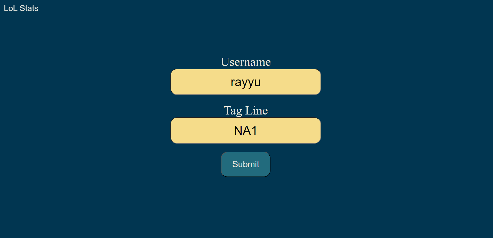
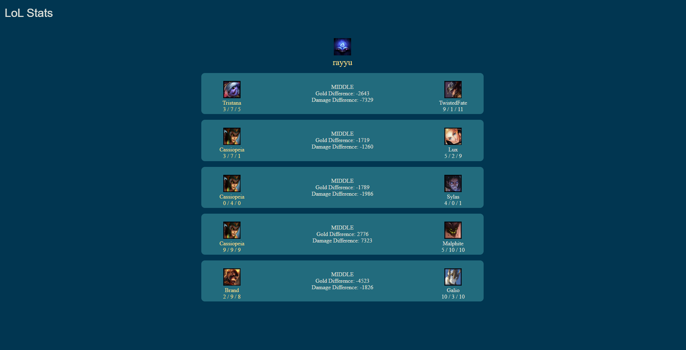
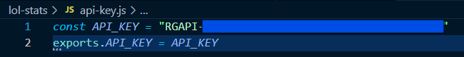

# League of Legends Stat Tracker
Electron Based Application using HTML/CSS/JS to get player data from the video game League of Legends using the Riot Games Developer API.  

# Project Motivation
For several years, a significant amount of my free time has been consumed by League of Legends. I particularly enjoyed playing the competitive "Ranked" game mode where you try to climb to higher ranks by winning games. This mode requires more attention and focus than just loading up the casual mode. I have made this web app to hopefully obtain useful insight to help my gameplay.

# Quick Overview
<u>Profile Search Screen:</u> 
Enter username as displayed in game and tagline which is also shown in the game/client without the # that is follows 
  

<u>Example Results Page:</u> 
User's name and icon will be displayed with the 5 most recent matches 

# How to Run
- run by typing "npm start" in the terminal
- API Key:
  - found in the file /lol-stats/api-key.js
  - there is no check for an up to date API Key
  - must get your own API Key from https://developer.riotgames.com/
  - NOTE: this key expires daily 
  - This file is ignored by the repository so the key is not uploaded, must set up yourself:
  - 
  
***
# Features Notes
- see 5 recent matches 
  - see older games (WIP)
- use ddragon API to get champ and player icons 
- stats for you and enemy laner
  - champion
  - KDA
  - gold difference
  - damage dealt difference
- "see more" page (WIP)
  - for all teammates: KDA and damage dealt
  - can add notes to matches (then save to localStorage only if note is added)
***
# Implementation Notes
## displayMatchData()
  - enemy laner is found by using the fact that in the Riot Games API, the order is always Team 1 then Team 2 with the roles in the same order
    - i.e. with the 10 players, 0 vs 5, 1 vs 6, 2 vs 7, 3 vs 8, 4 vs 9, 5 vs 10 = (userIndex + 5) mod 10
  -  used Text Nodes to set text instead of innerHTML because it is more secure
  - Create a file named "api-key.js" that exports the value of the Riot Games Developer API Key
  - used textContents to update html in JS (instead of using innerHTML) because it is more secure 
## proxyServer.js
axios.get() is a Promise thats why "await" is used when calling getPlayerPUUID
***
# Credits
 LoL Stats isn't endorsed by Riot Games and doesn't reflect the views or opinions of Riot Games or anyone officially involved in producing or managing Riot Games properties. Riot Games, and all associated properties are trademarks or registered trademarks of Riot Games, Inc
  
